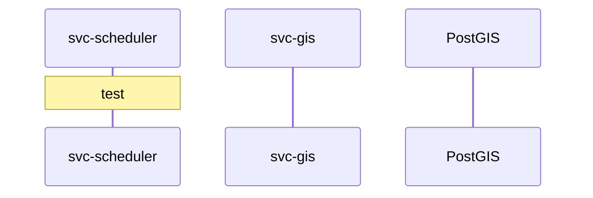
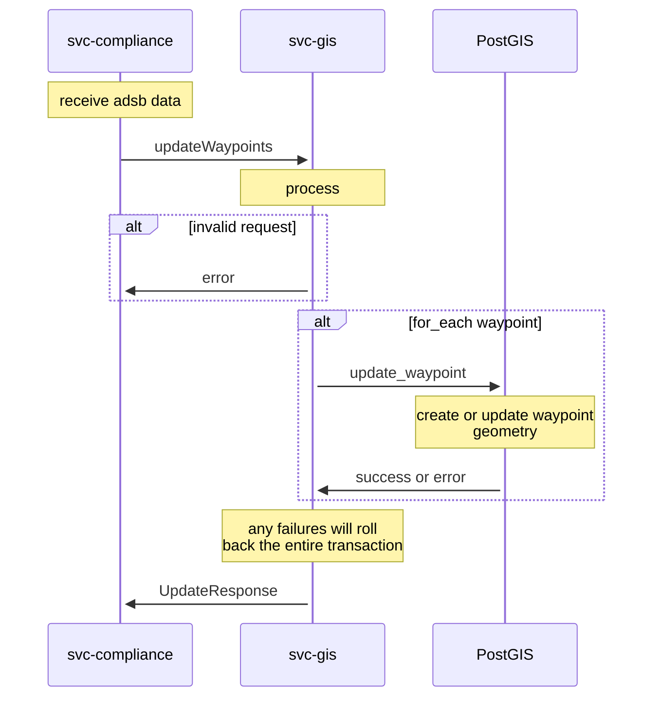
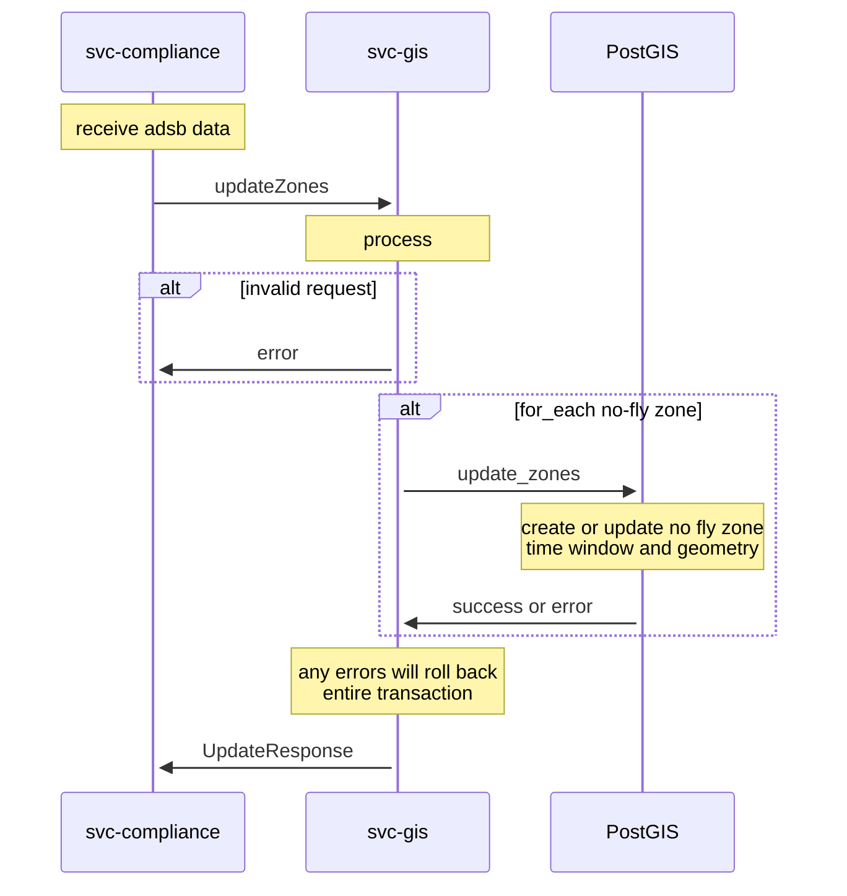
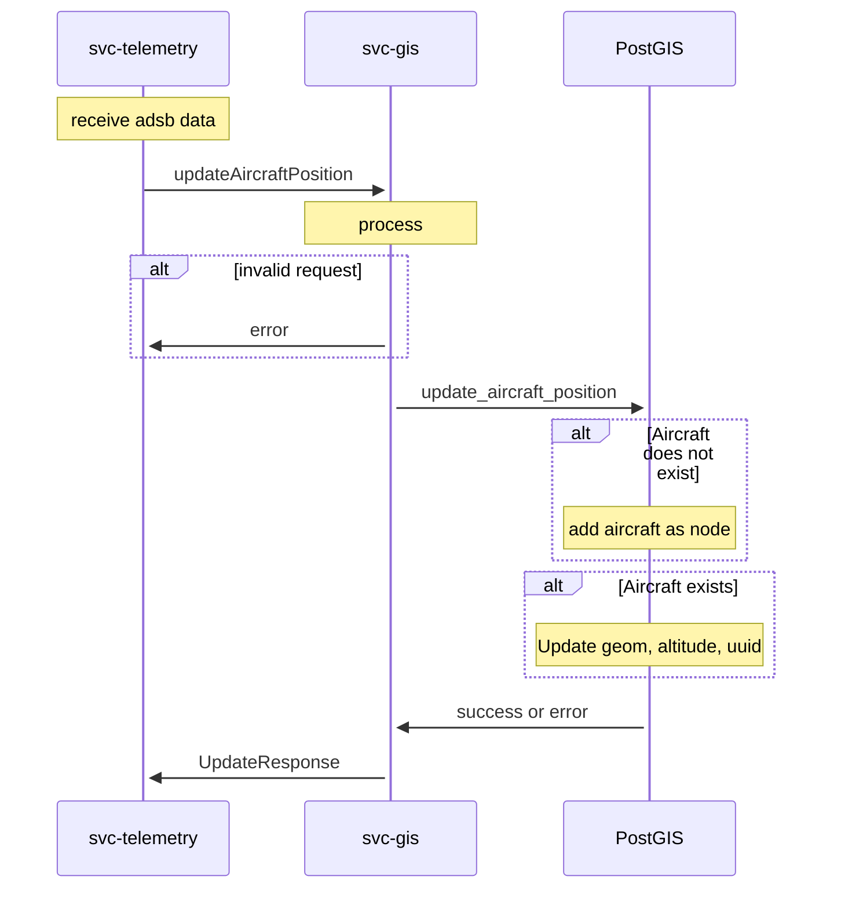
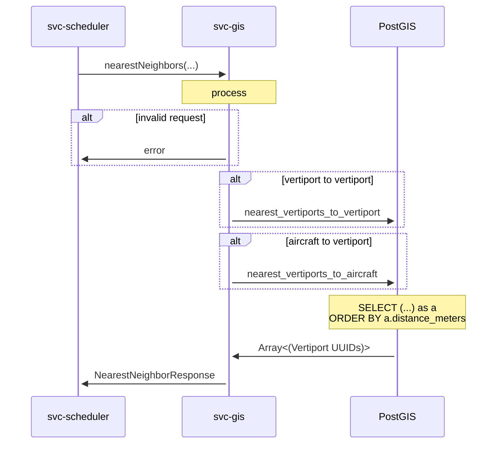

# Software Design Document (SDD) - `svc-gis` 

## :telescope: Overview

This document details the software implementation of svc-gis.

This service is the abstraction layer to the PostGIS database, similar to how `svc-storage` is the abstraction layer to the PostgreSQL database.

Attribute | Description
--- | ---
Status | Draft

## :books: Related Documents

Document | Description
--- | ---
[High-Level Concept of Operations (CONOPS)](https://github.com/Arrow-air/se-services/blob/develop/docs/conops.md) | Overview of Arrow microservices.
[High-Level Interface Control Document (ICD)](https://github.com/Arrow-air/se-services/blob/develop/docs/icd.md)  | Interfaces and frameworks common to all Arrow microservices.
[Requirements - `svc-gis`](https://nocodb.arrowair.com/dashboard/#/nc/view/5a893886-20f3-41f6-af95-6a235ca52647) | Requirements and user stories for this microservice.
[Concept of Operations - `svc-gis`](./conops.md) | Defines the motivation and duties of this microservice.
[Interface Control Document (ICD) - `svc-gis`](./icd.md) | Defines the inputs and outputs of this microservice.

## :dna: Module Attributes

Attribute | Applies | Explanation
--- | --- | ---
Safety Critical | Y | This module gates access to the PostGIS database which will be used to calculate potential collisions from current aircraft positions. 

## :globe_with_meridians: Global Variables

None

## :gear: Logic

### Initialization

At initialization this service creates two servers on separate threads: a GRPC server and a REST server.

The REST server expects the following environment variables to be set:
- `DOCKER_PORT_REST` (default: `8000`)

The GRPC server expects the following environment variables to be set:
- `DOCKER_PORT_GRPC` (default: `50051`)

### Control Loop

As a REST and GRPC server, this service awaits requests and executes handlers.

Some handlers **require** the following environment variables to be set:
- PG__USER
- PG__DBNAME
- PG__HOST
- PG__PORT
- PG__SSLMODE
- DB_CA_CERT
- DB_CLIENT_CERT
- DB_CLIENT_KEY

This information allows `svc-gis` to connect to the PostgreSQL database.

### Cleanup

None

## :speech_balloon: gRPC Handlers

See [the ICD](./icd.md) for this microservice.

### updateVertiports

### updateWaypoints

### updateZones

### updateAircraftPosition

### bestPath

### nearestNeighbors

:warning: This nearest neighbor search is not used in R3 and will be reworked in R4.

