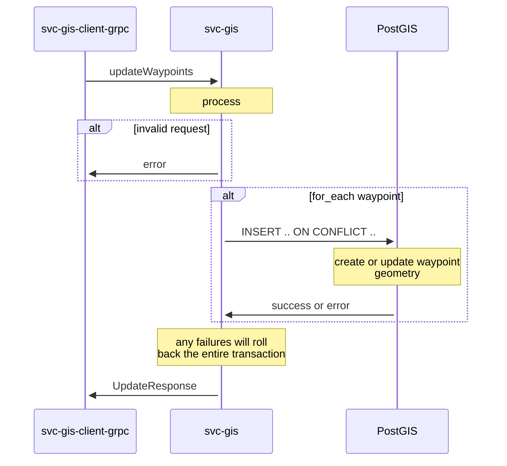
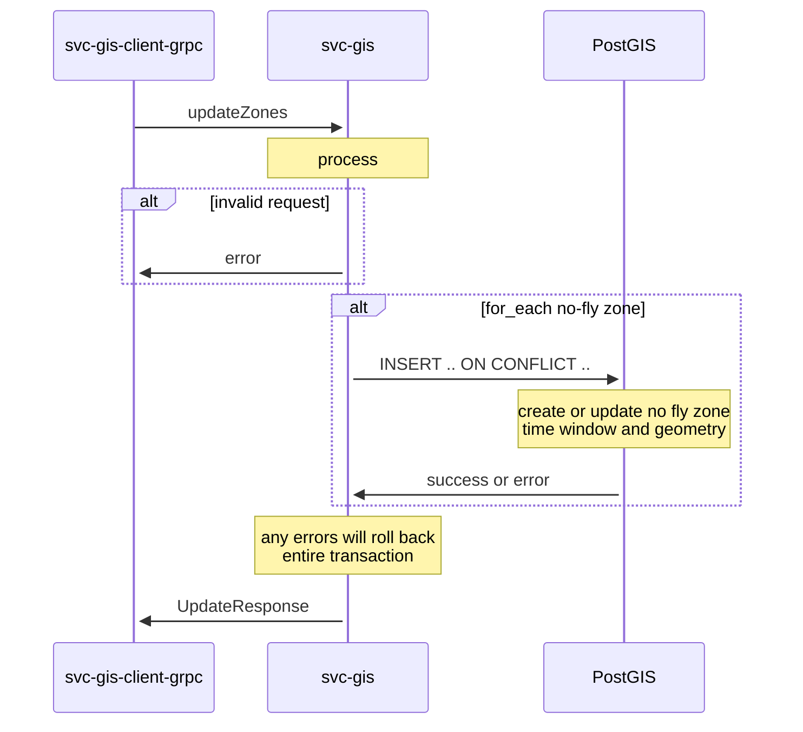
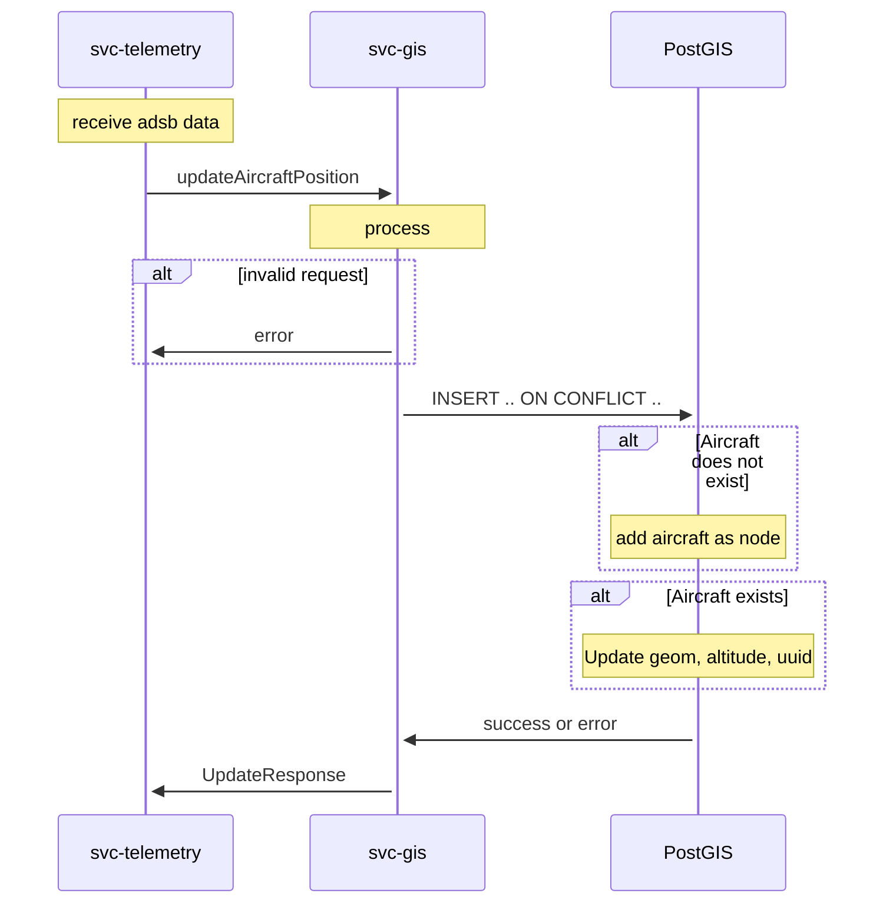
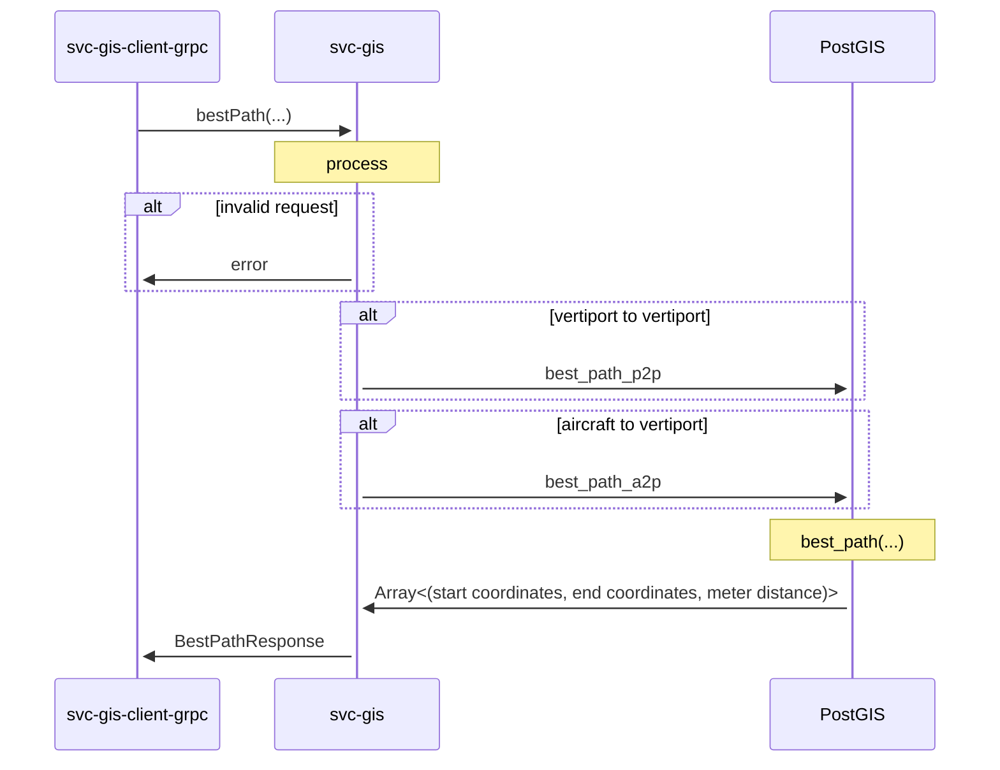
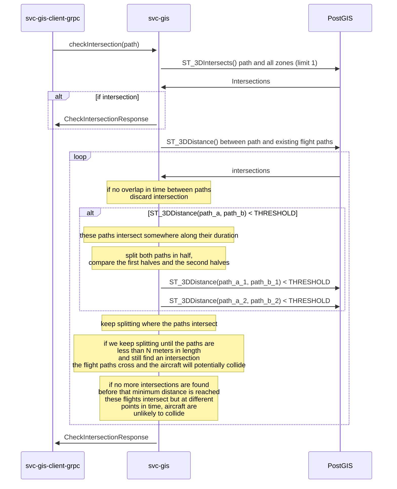

# Software Design Document (SDD) - `svc-gis` 

## :telescope: Overview

This document details the software implementation of svc-gis.

This service is the abstraction layer to the PostGIS database, similar to how `svc-storage` is the abstraction layer to the PostgreSQL database.

Attribute | Description
--- | ---
Status | Draft

## :books: Related Documents

Document | Description
--- | ---
[High-Level Concept of Operations (CONOPS)](https://github.com/aetheric-oss/se-services/blob/develop/docs/conops.md) | Overview of Aetheric microservices.
[High-Level Interface Control Document (ICD)](https://github.com/aetheric-oss/se-services/blob/develop/docs/icd.md)  | Interfaces and frameworks common to all Aetheric microservices.
[Requirements - `svc-gis`](https://nocodb.aetheric.nl/dashboard/#/nc/view/5a893886-20f3-41f6-af95-6a235ca52647) | Requirements and user stories for this microservice.
[Concept of Operations - `svc-gis`](./conops.md) | Defines the motivation and duties of this microservice.
[Interface Control Document (ICD) - `svc-gis`](./icd.md) | Defines the inputs and outputs of this microservice.

## :dna: Module Attributes

Attribute | Applies | Explanation
--- | --- | ---
Safety Critical | Y | This module gates access to the PostGIS database which will be used to calculate potential collisions from current aircraft positions. 

## :globe_with_meridians: Global Variables

None

## :gear: Logic

### Initialization

At initialization this service creates two servers on separate threads: a GRPC server and a REST server.

The REST server expects the following environment variables to be set:
- `DOCKER_PORT_REST` (default: `8000`)

The GRPC server expects the following environment variables to be set:
- `DOCKER_PORT_GRPC` (default: `50051`)

### Control Loop

As a REST and GRPC server, this service awaits requests and executes handlers.

Some handlers **require** the following environment variables to be set:
- PG__USER
- PG__DBNAME
- PG__HOST
- PG__PORT
- PG__SSLMODE
- DB_CA_CERT
- DB_CLIENT_CERT
- DB_CLIENT_KEY

This information allows `svc-gis` to connect to the PostgreSQL database.

### Cleanup

None

## :speech_balloon: gRPC Handlers

See [the ICD](./icd.md) for this microservice.

### updateVertiports

### updateWaypoints

### updateZones

### updateAircraftPosition

### bestPath

### checkIntersection

This compares a path against two sources of geometry: zones and existing flight paths.

Currently any overlap between a path and a zone will be considered an intersection.

A different method is taken with comparing flight paths with one another. First flight paths are compared in their entireties for intersection to narrow down the field of possible aircraft collisions.

These full path intersections aren't disqualifying, as the flights may occur at non-overlapping times or may overlap in time in such a way that the two aircraft will be unlikely to come near one another.

As an example, two identical flights between vertiports A and B may have identical flight paths. However, if they leave 3 days apart, it is improbable that a collision will occur. Likewise, for any paths that intersect at a point in space, the time at which the intersection occurs must be taken into account before declaring an intersection.

We consider an "intersection" to be any two paths that come within N meters of one another. This turns flight paths into 3D cylindrical volumes for the purposes of determining intersection.

